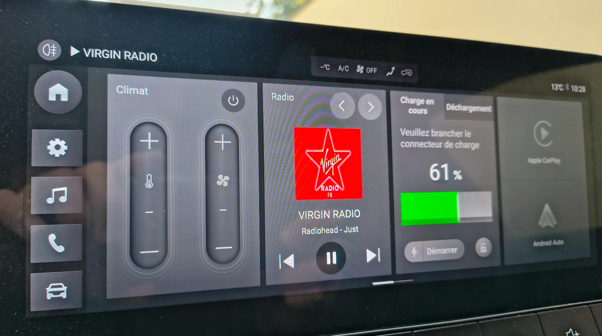

# MG4 Radio — DAB+ Slideshow Art on Launcher + Auto-Resume

Patch for the SAIC MG4 (EH32 LL firmware) head unit that:
1. Fixes missing **DAB+ station artwork** on the stock launcher home screen.
2. Adds **automatic radio resume** when the car starts — the radio plays again on its own, without opening the app.



*Virgin Radio artwork displayed live on the launcher home screen — song title included.*

---

> ## ⚠️ A REBOOT IS REQUIRED AFTER INSTALLING
>
> This is **not optional**. The radio runs as a system service that is already loaded in memory; the new APK only takes effect once the head unit restarts. After installing, **reboot the unit** (hold the Home button ~20 s until the screen turns off and it restarts). Until you reboot, you will keep running the old version and may think the patch "did nothing".

---

## What this fixes

### 1. DAB+ artwork on the launcher

On the stock MG4 head unit, when you listen to a DAB+ station that broadcasts artwork (station logo, album cover, show image…), the image appears correctly **inside the radio app** — but the launcher home screen always shows a generic placeholder instead of the actual artwork.

After this patch, **the artwork appears directly on the launcher home screen**, along with the station name and current song title, without having to open the radio app.

> **⏱️ Be patient with the image — 10–60 s is normal.** DAB+ stations only push their slideshow image periodically (typically every 10–30 s), and reception conditions add delay. So after a fresh start or a station change, the artwork can take **anywhere from ~10 to ~60 seconds** to appear or update, depending on signal quality and how often that particular station transmits images. A few stations send **no images at all** — this is rare, but when it happens there is nothing the patch can do. The per-station cache (below) makes already-seen stations show instantly.

### 2. Auto-resume on car start

If the radio was playing when you switched the car off, it now **starts playing again automatically** the next time you start the car — no need to open the radio app or press play.

- Controlled by an **on-screen toggle** added to the FM and DAB pages ("Auto-resume: ON / OFF"). Default is **ON**.
- If you **manually paused** the radio before switching off, it stays paused on the next start (your choice is respected).
- Works for both **FM/AM** and **DAB+**.

**How it works:** at boot the car asks the radio to load as the active media source but in a *muted / paused* state (this is the stock behaviour — it's why the station name shows on the launcher but no sound plays). The patch intercepts that moment and, when auto-resume is enabled and the radio was playing at shutdown, routes it through the radio's normal tune-and-play path instead, so audio actually starts.

### Bonus: instant artwork on station switch

DAB+ stations only broadcast their slideshow image every 10–30 seconds. Without caching, you'd have to wait up to half a minute each time you switch stations for the image to appear on the launcher.

This patch also **remembers the last image received for each station** and restores it immediately the next time you tune to that station, so the artwork is visible right away. (The first time you ever hear a station, you still have to wait for its first broadcast — see the 10–60 s note above.)

### Image cropping

Some stations broadcast rectangular images with side bars (e.g. France Info). When the bars are a single uniform colour the patch **center-crops to a clean square**; otherwise it **letterboxes** the image onto a square canvas. Either way images fit the launcher widget correctly without distortion.

---

## How it works (technical)

### DAB+ artwork

The stock radio app receives slideshow bitmaps via `onDabSlideShowChanged()` in `RadioService$DabTunerCallback` and forwards them to its own UI — but never publishes them to the Android `MediaSession` (`ALBUM_ART` metadata key). The launcher reads artwork exclusively from `MediaSession`, so it never received anything.

**This adds:**
- Forward of each received bitmap to `MediaSession` via `IRadioMBSCallback.setSessionMetadataDabBitmap()`
- Per-station disk cache (`dab_<serviceId>.jpg`) — saved on receive, restored on tune
- Uniform-colour side-bar crop to square, with letterbox fallback for non-uniform bars
- Proper synchronization (`synchronized(mMBSCallbacks)`) and null-guards matching the existing code patterns

### Auto-resume

At boot the car sends `RadioService.onStartCommand()` a "resume as source" command (event `0x8006`), which the stock code handles via `resumeOnlySource()` / `resumeDabOnlySource()` — these deliberately `mute(true)` and set the session to **PAUSED** (source loaded, silent). That is why the launcher shows the station name but nothing plays.

**This adds:** a gate at the top of `resumeOnlySource()` / `resumeDabOnlySource()` — when the **Auto-resume** preference is ON **and** the radio was playing at shutdown, it instead calls the radio's existing `resumeTunerChannel()` / `resumeDabTunerChannel()` (full tune + `PLAYING` state) so audio actually starts. The preference and last-playing state are persisted in `RadioSharedPreference`; the on-screen toggle and play-state tracking live in the FM/DAB presenters and fragments.

Everything is contained in the **radio APK** — the launcher APK is untouched. See [`patches/radio/`](patches/radio/) for the exact modified smali and resource files.

---

## Installation

### Option A — Direct APK install (recommended)

1. Download **[Radio_patched_signed.apk](https://github.com/Skittle6938/MG4-Radio-DABplus-Fix/raw/main/apk/Radio_patched_signed.apk)**
2. Copy it to a USB stick and plug it into the head unit's USB port
3. Open the APK with the built-in file manager to install it

> **⚠️ A REBOOT IS REQUIRED after installation — this is not optional.** Hold the Home button for approximately 20 seconds until the screen turns off and the unit restarts. Until you reboot, the old version keeps running and the patch will appear to do nothing.

### Option B — ADB over USB

ADB is disabled by default on the MG4 head unit. You need to enable it first using **ADB_util**, a tool developed by Leon Kerman:

> [XDA thread — MG4 Electric AAOS 9 playing (and possibly other MG models)](https://xdaforums.com/t/mg4-electric-aaos-9-playing-and-possibly-other-mg-models.4697712/post-90591053)

Once USB debugging is enabled:

1. Connect a USB cable between your PC and the head unit
2. Run:
   ```bash
   adb push Radio_patched_signed.apk /data/local/tmp/radio_patch.apk
   adb shell pm install -f /data/local/tmp/radio_patch.apk
   ```
   The `-f` flag is required to replace the system app with the patched version.

> **⚠️ A REBOOT IS REQUIRED after installation — this is not optional.** Hold the Home button for approximately 20 seconds until the screen turns off and the unit restarts. Until you reboot, the old version keeps running and the patch will appear to do nothing.

---

## Reverting

```bash
adb shell pm uninstall com.saicmotor.radio
```
The system original under `/system/priv-app/Radio_eh32_ll/` is restored automatically.

---

## Firmware compatibility

Tested on: `Radio_eh32_ll`  
Check your version before installing:
```bash
adb shell dumpsys package com.saicmotor.radio | grep versionName
```
